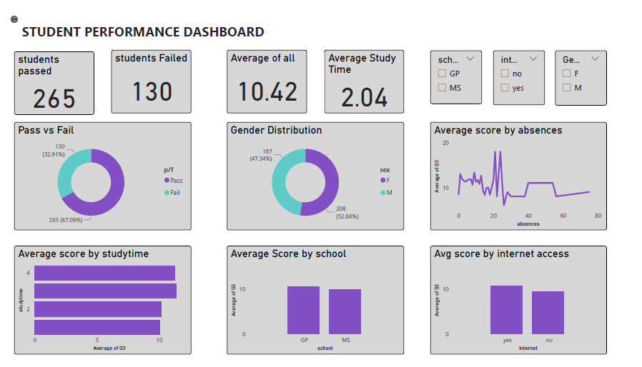

#  Student Final Grade Predictor App

An interactive machine learning web app using **Streamlit** that predicts student final grades (G3) based on academic indicators like G1, G2, study time, and absences. Includes data visualizations, model performance metrics, and a Power BI dashboard snapshot for deeper insights.

---

##  Features

- **Predict G3 score** using academic data
- **EDA and Visualizations** (correlation heatmap, trends)
- **Embedded Power BI dashboard** (Math dataset)
- **Streamlit web app** with dark theme UI

---

## How to Run the App

###  1. Clone the repository

```bash
git clone https://github.com/yourusername/student-score-predictor.git
cd student-score-predictor
```

### 2. Set up virtual environment

```bash
python -m venv .venv
source .venv/bin/activate  # On Windows use: .venv\Scripts\activate
```

### 3. Install dependencies

```bash
pip install -r requirements.txt
```

### ▶4. Run the app

```bash
streamlit run app/streamlit_app.py
```

---

##  Project Structure

```
student-score-predictor/
│
├── app
   ├── streamlit_app.py              # Main Streamlit app
├── requirements.txt              # Python dependencies
│
├── model/
│   ├── regressor.pkl             # Trained Random Forest model
│   ├── scaler.pkl                # StandardScaler for input features
│   └── metrics.pkl               # Model performance metrics (R², MAE, RMSE)
│
├── data/
│   ├── math_dataset.csv          # Math subject dataset
│   ├── portugese_dataset.csv     # Portuguese subject dataset
│   └── plots/
│       ├── top10_corr_g3.png
│       ├── studytime_vs_g3.png
│       ├── absences_vs_g3.png
│       ├── actual_vs_pred.png
│       ├── eda_heatmap.png
│       └── powerbi_dashboard.png  # Power BI snapshot image
│
└── EDA_and_Modeling.py    # Script for preprocessing, training, and saving models/plots
        
```

---

## Power BI Dashboard



- The Power BI dashboard is created using the Math dataset.
- Due to Streamlit and Power BI Desktop limitations, a static image is displayed in the app.
- Interactive version available only in Power BI Desktop (free version doesn't support web embedding).

---

##  Future Improvements

- Deploy on Streamlit Cloud
- Add subject-specific model selection
- Add feature to compare different ML models visually
- Enable live Power BI embedding (if using Power BI Pro or publish to web)

---

## Author

- **Vidushi Singh**
- Minor Project CS3270: *"Student Exam Score Prediction"*

---
